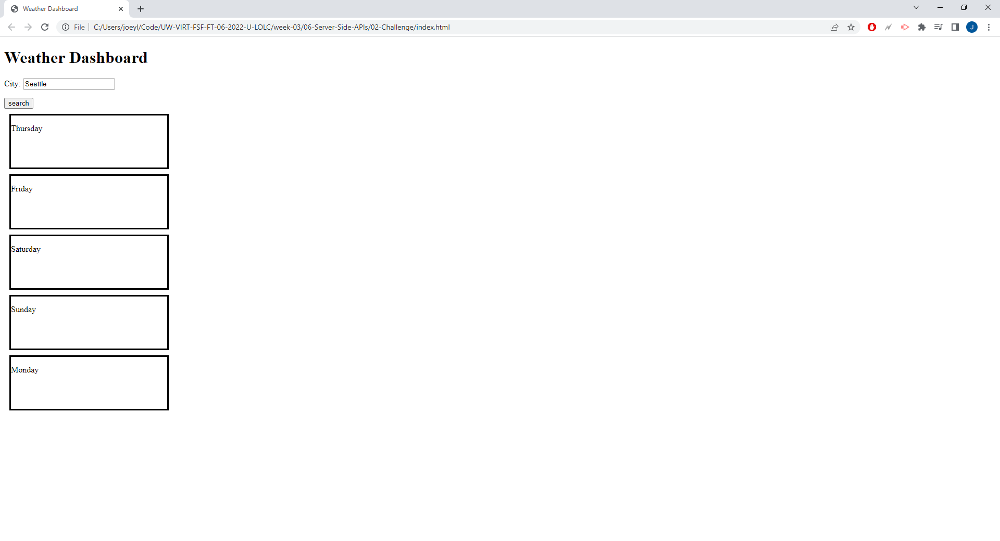

# Weather-API-M6

## Task and what I learned
- To create a weather dashboard that shows a 5 day forecast using 3rd party API.
- I could not get the api to work and I was unsure how I kept getting a 401 error. Thought I should still submit as I had already used one drop though.
- More complicated for loops now, not sure if inputed properly.
- Was able create a day function and get that onto the HTML was happy about that.

## Screenshots
- 

## URL
- Repo URL: https://github.com/JoeyLiu518/Weather-API-M6
- Deployed URL:  https://joeyliu518.github.io/Weather-API-M6/
